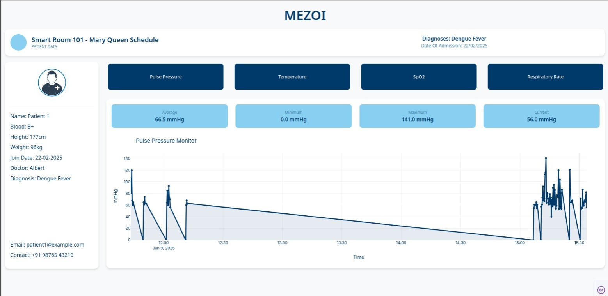

# MEZOI Healthcare Monitoring System

A real-time healthcare monitoring dashboard that collects vital signs data from Bluetooth Low Energy (BLE) devices and displays interactive visualizations through a web-based interface.

## Features

- **Real-time Vital Signs Monitoring**: Tracks pulse pressure, temperature, SpO2, and respiratory rate
- **Voice-Activated Dashboard**: Launch with "Hey Apollo" voice command
- **Interactive Visualizations**: Click-to-switch between different vital sign charts
- **Patient Management**: Complete patient information display with medical history
- **BLE Device Integration**: Seamless connection with Vincense Watch sensors
- **MongoDB Storage**: Robust data persistence and historical tracking
- **Responsive Design**: Clean, modern UI with healthcare-focused color scheme

## Dashboard Preview



The dashboard provides:
- **Patient Information Panel**: Demographics, medical history, and current diagnosis  
- **Metric Selection Cards**: Interactive buttons for different vital signs  
- **Real-time Charts**: Live updating graphs with statistical summaries  
- **Alert Thresholds**: Visual indicators for abnormal readings (fever, low SpO2, etc.)


## System Architecture

```
BLE Sensor (Vincense Watch) → Python BLE Client → MongoDB → Dash Dashboard (Web page)
```

## Prerequisites

- Python 3.7 or higher
- MongoDB server (locally running)
- Bluetooth Low Energy compatible device (like a smart watch)
- Microphone for voice commands (optional)

## Installation

1. **Clone the repository**
   ```bash
   git clone https://github.com/sabeshraaj/BLE.git
   cd BLE
   ```

2. **Install Python dependencies**
   ```bash
   pip install -r requirements.txt
   ```

3. **Set up MongoDB**
   - Install MongoDB on your system
   - Start MongoDB service
   - Update the MongoDB URI in both files if needed

4. **Configure BLE Device**
   - Update the `address` variable in the BLE client with your device's MAC address
   - Ensure your BLE device is discoverable and paired

## Dependencies

```txt
dash==2.14.1
dash-bootstrap-components==1.4.1
plotly==5.15.0
pandas==2.0.3
numpy==1.24.3
pymongo==4.4.1
bleak==0.20.2
speech-recognition==3.10.0
gtts==2.3.2
asyncio
threading
webbrowser
os
datetime
```

## Usage

### 1. Start the BLE Data Collector
```bash
python watch_to_mongo.py
```
This will:
- Connect to your Vincense Watch
- Start collecting vital signs data
- Store data in MongoDB in real-time

### 2. Launch the Dashboard
```bash
python webdashboard.py
```
Or use voice command: Say **"Hey Apollo"** to automatically launch the dashboard.

### 3. Access the Dashboard
Open your browser and navigate to: `http://localhost:8051`

## Data Structure

The system stores data in MongoDB with the following structure:

```json
{
  "patient_id": "p1",
  "watch_id": "F8:55:48:15:F7:A3",
  "timestamp": "2025-06-11T10:30:00.000Z",
  "pulse_pressure": 68,
  "temperature": 36.8,
  "spo2": 98,
  "respiratory_rate": 16
}
```
The above data is just random placefiller data to show how the system stores data

## 🔧 Configuration

### MongoDB Configuration
Update the MongoDB URI in both files:
```python
# In dashboard.py
client = MongoClient("mongodb://localhost:27017/")

# In ble_client.py  
mongo_uri = "mongodb://<your ip addr>:27017/"  # Update with your MongoDB IP
```

### BLE Device Configuration
Update the device address and UUIDs:
```python
address = "XX:XX:XX:XX:XX:XX"  # Your device's MAC address
write_uuid = "f0001200-0551-4000-b000-000000000000"
notify_uuid = "f0001100-0551-4000-b000-000000000000"
```

## Customization

### Adding New Patients
Update the patient information in the dashboard layout:
```python
html.P("Name: Patient 1", style={'margin': '8px 0', 'color': COLORS['text']}),
html.P("Blood: B+", style={'margin': '8px 0', 'color': COLORS['text']}),
# Add more patient details...
```

### Modifying Alert Thresholds
Adjust the medical thresholds in the chart generation:
```python
# Temperature fever threshold
fig.add_hline(y=37.5, line_dash="dash", line_color='red', 
             annotation_text="Fever Threshold (37.5°C)")

# SpO2 normal threshold  
fig.add_hline(y=95, line_dash="dash", line_color='green', 
             annotation_text="Normal SpO2 (95%+)")
```

## Troubleshooting

### Common Issues

1. **BLE Connection Failed**
   - Ensure your device is powered on and discoverable
   - Check if the MAC address is correct
   - Verify Bluetooth is enabled on your system

2. **MongoDB Connection Error**
   - Confirm MongoDB service is running
   - Check if the connection URI is correct
   - Ensure the database and collection exist

3. **Voice Command Not Working**
   - Check microphone permissions
   - Verify `speech_recognition` library is properly installed
   - Test microphone with other applications

4. **Dashboard Not Loading**
   - Ensure port 8051 is not blocked by firewall
   - Check if all dependencies are installed
   - Verify MongoDB has data to display

## Contributing

1. Fork the repository
2. Create your feature branch (`git checkout -b feature/AmazingFeature`)
3. Commit your changes (`git commit -m 'Add some AmazingFeature'`)
4. Push to the branch (`git push origin feature/AmazingFeature`)
5. Open a Pull Request


## Future Enhancements

- [ ] Multiple patient support
- [ ] Email/SMS alerts for critical readings
- [ ] Machine learning-based anomaly detection
- [ ] Export data to PDF reports
- [ ] Mobile app companion
- [ ] Integration with hospital management systems
- [ ] Advanced analytics and trends
- [ ] Multi-language support

## Support

For support and questions:
- Create an issue in this repository
  
## Acknowledgments

- Built with [Dash](https://dash.plotly.com/) framework
- BLE communication via [Bleak](https://github.com/hbldh/bleak)
- Data visualization with [Plotly](https://plotly.com/)
- Voice recognition powered by [SpeechRecognition](https://pypi.org/project/SpeechRecognition/)

---

**Medical Disclaimer**: This system is for educational and research purposes only. It should not be used as a substitute for professional medical advice, diagnosis, or treatment. Always consult with qualified healthcare providers for medical decisions.
